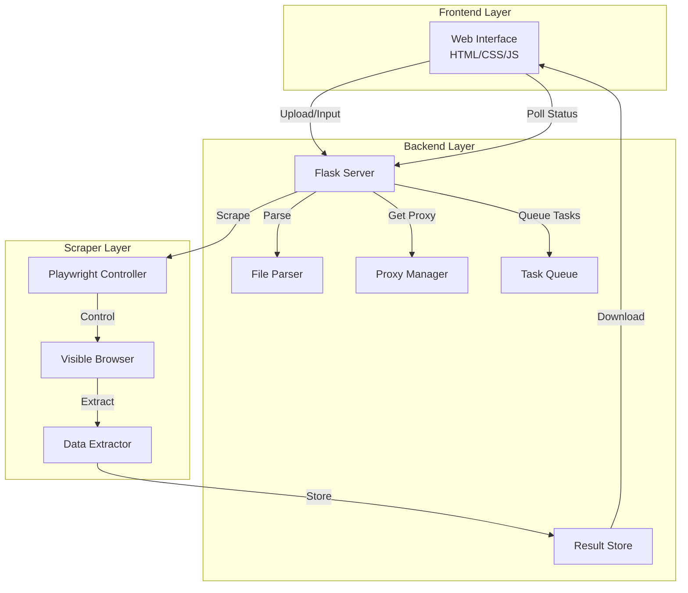
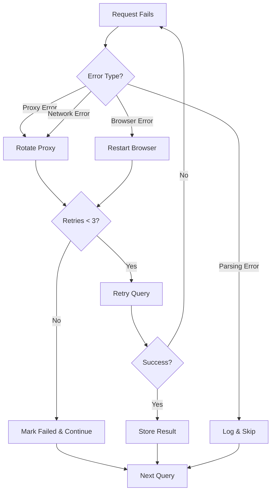

# Design Document: Google Maps Scraper

## Overview

The Google Maps Scraper is a web-based application that extracts business information from Google Maps without using official APIs. The system consists of three main layers: a web frontend for user interaction, a Flask backend for orchestration, and a Playwright-based scraper module for data extraction. The application implements intelligent proxy rotation to avoid detection and provides real-time progress monitoring.

## Architecture

### High-Level Architecture



### Technology Stack

- **Frontend**: HTML5, CSS3, Vanilla JavaScript
- **Backend**: Python 3.9+, Flask 2.x
- **Browser Automation**: Playwright (Chromium)
- **Data Processing**: pandas (for CSV/Excel), openpyxl
- **File Formats**: CSV, Excel (.xlsx), JSON

### Directory Structure

```
google-maps-scraper/
├── app.py                 # Flask application entry point
├── config.py              # Configuration settings
├── proxies.txt            # Proxy list (IP:PORT:USER:PASS)
├── requirements.txt       # Python dependencies
├── static/
│   ├── css/
│   │   └── style.css     # Frontend styles
│   └── js/
│       └── app.js        # Frontend logic
├── templates/
│   └── index.html        # Main web interface
├── modules/
│   ├── __init__.py
│   ├── proxy_manager.py  # Proxy rotation logic
│   ├── scraper.py        # Playwright scraper
│   ├── file_parser.py    # CSV/Excel parser
│   └── data_extractor.py # Google Maps data extraction
└── uploads/              # Temporary file storage
```

## Components and Interfaces

### 1. Frontend Component (Web Interface)

**Responsibilities:**
- Provide dual input methods (file upload and manual form)
- Display real-time scraping progress
- Show active proxy and success/failure counts
- Enable result download

**Key Elements:**
- File upload input (accepts .csv, .xlsx)
- Manual entry form (keyword, zip code, URL fields with add/remove rows)
- Progress bar with percentage
- Status table showing current query, proxy, success/failure counts
- Start/Stop buttons
- Download buttons (CSV/JSON)

**API Endpoints Used:**
- `POST /upload` - Upload file
- `POST /start` - Start scraping with manual input
- `GET /status` - Poll scraping status
- `GET /download/<format>` - Download results
- `POST /stop` - Stop scraping

### 2. Flask Server Component

**File: `app.py`**

```python
# Key routes and their purposes
@app.route('/')                    # Serve main interface
@app.route('/upload', methods=['POST'])  # Handle file uploads
@app.route('/start', methods=['POST'])   # Start scraping
@app.route('/status')              # Return current status
@app.route('/stop', methods=['POST'])    # Stop scraping
@app.route('/download/<format>')   # Download results
```

**Responsibilities:**
- Route HTTP requests
- Coordinate between components
- Manage scraping state (idle, running, completed)
- Store results in memory during scraping
- Generate downloadable files

**State Management:**
```python
app_state = {
    'status': 'idle',  # idle, running, completed, stopped
    'total_queries': 0,
    'processed': 0,
    'success_count': 0,
    'failure_count': 0,
    'current_query': '',
    'current_proxy': '',
    'results': []
}
```

### 3. Proxy Manager Component

**File: `modules/proxy_manager.py`**

**Class: `ProxyManager`**

```python
class ProxyManager:
    def __init__(self, proxy_file: str)
    def load_proxies(self) -> List[Dict]
    def get_next_proxy(self) -> Dict
    def mark_failure(self, proxy: Dict)
    def should_rotate(self) -> bool
    def reset_counter(self)
```

**Proxy Format:**
```
IP:PORT:USERNAME:PASSWORD
```

**Rotation Logic:**
- Maintain request counter (increments on each attempt)
- Rotate after 14 requests OR on failure
- Sequential rotation through proxy list
- Cycle back to first proxy after reaching the end

**Proxy Object Structure:**
```python
{
    'server': 'http://IP:PORT',
    'username': 'USERNAME',
    'password': 'PASSWORD'
}
```

### 4. File Parser Component

**File: `modules/file_parser.py`**

**Class: `FileParser`**

```python
class FileParser:
    @staticmethod
    def parse_csv(file_path: str) -> List[Dict]
    @staticmethod
    def parse_excel(file_path: str) -> List[Dict]
    @staticmethod
    def validate_data(data: List[Dict]) -> Tuple[bool, str]
```

**Expected Input Format:**
- CSV/Excel columns: `keyword`, `zip_code`, `url` (optional)
- Returns list of dictionaries with validated data

**Validation Rules:**
- Keyword: required, non-empty string
- Zip code: required, numeric or alphanumeric
- URL: optional, valid URL format if provided

### 5. Scraper Component

**File: `modules/scraper.py`**

**Class: `GoogleMapsScraper`**

```python
class GoogleMapsScraper:
    def __init__(self, proxy_manager: ProxyManager, headless: bool = False)
    async def initialize_browser(self, proxy: Dict)
    async def search_google_maps(self, keyword: str, zip_code: str)
    async def extract_business_data(self) -> List[Dict]
    async def close_browser(self)
    async def scrape_query(self, query: Dict) -> List[Dict]
```

**Scraping Flow:**
1. Initialize Playwright browser with current proxy
2. Navigate to Google Maps
3. Enter search query (keyword + zip code)
4. Wait for results to load
5. Extract business information from result cards
6. Handle pagination if needed
7. Return extracted data

**Browser Configuration:**
- Headless: False (visible browser)
- Viewport: 1920x1080
- User agent: Randomized desktop user agents
- Proxy: Configured per browser instance

### 6. Data Extractor Component

**File: `modules/data_extractor.py`**

**Class: `DataExtractor`**

```python
class DataExtractor:
    @staticmethod
    async def extract_business_info(page, element) -> Dict
    @staticmethod
    def clean_phone_number(phone: str) -> str
    @staticmethod
    def clean_rating(rating: str) -> float
    @staticmethod
    def extract_review_count(text: str) -> int
```

**Extracted Fields:**
```python
{
    'name': str,
    'address': str,
    'phone': str,
    'website': str,
    'rating': float,
    'review_count': int,
    'category': str,
    'keyword': str,  # Original search keyword
    'zip_code': str  # Original search zip code
}
```

**Selectors Strategy:**
- Use data attributes and ARIA labels when available
- Fallback to CSS classes with defensive checks
- Handle missing fields gracefully (return None or empty string)

## Data Models

### Query Model

```python
@dataclass
class Query:
    keyword: str
    zip_code: str
    url: Optional[str] = None
    
    def to_search_string(self) -> str:
        return f"{self.keyword} {self.zip_code}"
```

### Business Model

```python
@dataclass
class Business:
    name: str
    address: str
    phone: Optional[str]
    website: Optional[str]
    rating: Optional[float]
    review_count: Optional[int]
    category: Optional[str]
    keyword: str
    zip_code: str
    
    def to_dict(self) -> Dict:
        return asdict(self)
```

### Proxy Model

```python
@dataclass
class Proxy:
    ip: str
    port: int
    username: str
    password: str
    request_count: int = 0
    failure_count: int = 0
    
    def to_playwright_format(self) -> Dict:
        return {
            'server': f'http://{self.ip}:{self.port}',
            'username': self.username,
            'password': self.password
        }
```

## Error Handling

### Error Categories

1. **Proxy Errors**
   - Connection timeout (30 seconds)
   - Authentication failure
   - CAPTCHA detection
   - Action: Rotate to next proxy immediately

2. **Browser Errors**
   - Page load timeout (60 seconds)
   - Element not found
   - Browser crash
   - Action: Restart browser with new proxy, retry query

3. **Parsing Errors**
   - Invalid file format
   - Missing required columns
   - Invalid data types
   - Action: Return validation error to user

4. **Network Errors**
   - DNS resolution failure
   - Connection refused
   - Action: Mark proxy as failed, rotate

### Error Recovery Strategy



### Logging Strategy

- Log level: INFO for normal operations, ERROR for failures
- Log format: `[TIMESTAMP] [LEVEL] [COMPONENT] Message`
- Log file: `scraper.log` (rotating, max 10MB)
- Console output: Real-time status updates

## Testing Strategy

### Unit Tests

**Test Files:**
- `tests/test_proxy_manager.py`
- `tests/test_file_parser.py`
- `tests/test_data_extractor.py`

**Key Test Cases:**
1. Proxy rotation after 14 requests
2. Immediate rotation on proxy failure
3. CSV/Excel parsing with valid data
4. CSV/Excel parsing with invalid data
5. Data extraction with complete business info
6. Data extraction with missing fields

### Integration Tests

**Test File:** `tests/test_integration.py`

**Key Test Cases:**
1. End-to-end scraping with single query
2. File upload and parsing flow
3. Proxy rotation during multi-query scraping
4. Error recovery and retry logic

### Manual Testing Checklist

- [ ] Upload CSV file with 5 queries
- [ ] Upload Excel file with 5 queries
- [ ] Manual entry with 3 queries
- [ ] Verify visible browser launches
- [ ] Verify proxy rotation after 14 requests
- [ ] Trigger proxy failure (invalid proxy) and verify rotation
- [ ] Stop scraping mid-process
- [ ] Download results in CSV format
- [ ] Download results in JSON format
- [ ] Verify all business fields are extracted correctly

## Performance Considerations

### Scraping Speed

- Average time per query: 10-15 seconds
- Proxy rotation overhead: ~2 seconds (browser restart)
- Expected throughput: 4-6 queries per minute

### Resource Usage

- Memory: ~200MB per browser instance
- CPU: Moderate (browser rendering)
- Network: Depends on proxy speed

### Scalability Limitations

- Single browser instance (sequential scraping)
- No parallel processing in initial version
- Future enhancement: Multi-browser parallel scraping

## Security Considerations

### Proxy Credentials

- Store proxies in `proxies.txt` (not in version control)
- Add `proxies.txt` to `.gitignore`
- Use environment variables for sensitive configuration

### Input Validation

- Sanitize file uploads (check file type, size limit 5MB)
- Validate all user inputs before processing
- Prevent path traversal in file operations

### Rate Limiting

- Proxy rotation provides natural rate limiting
- No additional rate limiting needed initially
- Monitor for IP bans and adjust rotation frequency if needed

## Configuration

**File: `config.py`**

```python
class Config:
    # Flask settings
    SECRET_KEY = 'your-secret-key-here'
    UPLOAD_FOLDER = 'uploads'
    MAX_CONTENT_LENGTH = 5 * 1024 * 1024  # 5MB
    
    # Scraper settings
    PROXY_FILE = 'proxies.txt'
    ROTATION_THRESHOLD = 14
    REQUEST_TIMEOUT = 30
    PAGE_LOAD_TIMEOUT = 60
    HEADLESS = False
    
    # Browser settings
    VIEWPORT_WIDTH = 1920
    VIEWPORT_HEIGHT = 1080
    
    # Logging
    LOG_FILE = 'scraper.log'
    LOG_LEVEL = 'INFO'
```

## Deployment

### Local Development

1. Install Python 3.9+
2. Install dependencies: `pip install -r requirements.txt`
3. Install Playwright browsers: `playwright install chromium`
4. Add proxies to `proxies.txt`
5. Run: `python app.py`
6. Access: `http://127.0.0.1:5000`

### Production Considerations

- Use production WSGI server (Gunicorn, uWSGI)
- Enable HTTPS if exposing beyond localhost
- Implement proper session management
- Add authentication if needed
- Monitor proxy health and rotation
- Set up log rotation and monitoring

## Future Enhancements

1. **Parallel Scraping**: Multiple browser instances for faster processing
2. **Apify Migration**: Export scraper logic as Apify actor
3. **Advanced Proxy Management**: Health checks, automatic proxy replacement
4. **Result Caching**: Avoid re-scraping recent queries
5. **Scheduling**: Periodic scraping with cron-like functionality
6. **API Mode**: RESTful API for programmatic access
7. **Database Storage**: Persistent storage for results and history
8. **Advanced Filtering**: Filter results by rating, review count, etc.
